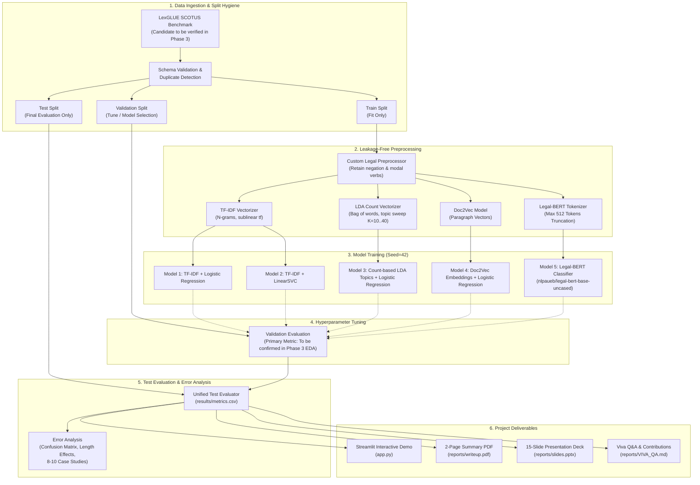

# Machine Learning Mini-Project Plan: Classification of Legal Text
**Course**: UE24CS352A - Machine Learning  
**Project**: Classification of Legal Text (US Supreme Court Opinions)  
**Target Completion**: October 10, 2026  

---

## 1. Executive Summary & Architecture
This project reproduces and extends the foundational work of Krithika Iyer (Stanford CS229, 2020) on classifying US Supreme Court legal opinions into standardized Supreme Court Database (SCDB) issue areas. While the reference paper explored LDA+LR and Doc2Vec+LR but suffered an out-of-memory failure on BERT (yielding zero Transformer metrics), our project delivers:
1. **Empirical Rigor**: Clear separation between baseline classical ML, paper reproductions, and modern Transformer extensions.
2. **Defensible Leakage Prevention**: Fitting all feature extractors, topic models, and embeddings exclusively on training data.
3. **Honest Long-Document Handling**: Transparent handling of Supreme Court opinion lengths with explicit truncation (512 tokens) and clear documentation.
4. **Complete Reproducibility**: Execution scripts with fixed seed (`seed=42`), headless validation, automated tests, and direct reporting of executed numbers.

---

## 2. Pipeline Architecture & Data Flow



---

## 3. Repository Structure
```
legal-text-classification/
├── README.md                 # Primary project overview, setup, reproducibility, results table
├── PROJECT_PLAN.md           # Architecture, pipeline, evaluation & compute strategy
├── requirements.txt          # Pinned project dependencies
├── .gitignore                # Filters caches, virtualenvs, datasets, large checkpoints
├── app.py                    # Streamlit interactive demonstration application
├── run_all.py                # Single-command end-to-end execution runner
├── src/                      # Modular, reusable source code
│   ├── __init__.py
│   ├── data.py               # Dataset loading, caching, schema validation, duplicate detection
│   ├── preprocess.py         # Legal-aware normalization and TF-IDF/count vectorizers
│   ├── evaluate.py           # Shared evaluation suite (F1 metrics, confusion matrix, reports)
│   └── utils.py              # Seed management, file I/O, figure plotting, metric exports
├── scripts/                  # Standalone executable CLI scripts per phase
│   ├── 01_run_eda.py         # Loads data, verifies schema, generates figures and stats
│   ├── train_classical.py    # Trains TF-IDF baselines and tunes on validation
│   ├── train_topic.py        # Sweeps LDA topics and trains Doc2Vec + LR
│   ├── 04_train_transformer.py # Trains Legal-BERT (resumable, saves predictions)
│   ├── 05_evaluate_all.py    # Evaluates all models on test set, writes metrics.csv
│   ├── 06_error_analysis.py  # Generates error breakdown and 8-10 case studies
│   ├── 07_build_reports.py   # Compiles writeup.pdf (verifying <=2 pages) and slides.pptx
│   └── 08_verify_pipeline.py # End-to-end audit verifying zero fabrication
├── data/                     # Data directory (raw gitignored; sample fixtures committed)
│   ├── sample_cases.json     # Small committed fixture for offline testing
│   └── cache/                # Gitignored local cache for downloaded datasets
├── models/                   # Small serialized model weights and vocabulary artifacts
│   └── README.md             # Instructions for regenerating large artifacts
├── results/                  # All empirical outputs (metrics, plots, reports)
│   ├── dataset_info.json     # Verified split sizes, label names, column schema
│   ├── eda_stats.json        # Descriptive statistics, length percentiles
│   ├── metrics.csv           # Final benchmark test metrics across all models
│   ├── metrics.json          # Complete metric dictionary
│   ├── transformer_run_info.json # Hardware, memory, batch size, device specs
│   ├── error_analysis.md     # Error patterns, length effects, case studies
│   ├── test_report.txt       # pytest test execution log
│   ├── figures/              # Generated visualizations (EDA, confusion matrices, comparisons)
│   └── classification_reports/ # Detailed per-model text reports
├── tests/                    # Pytest test suite
│   ├── test_data.py          # Schema validation, offline fixture loading
│   ├── test_preprocess.py    # Tokenization, legal negation preservation
│   ├── test_leakage.py       # Verifies fit only on train split
│   ├── test_models.py        # Small-sample fitting and shape verification
│   └── test_evaluate.py      # Hand-calculated metric verification
├── reports/                  # Official university deliverables
│   ├── writeup.py            # Programmatic source for 2-page report
│   ├── writeup.pdf           # Publication-grade writeup (<= 2 pages strictly enforced)
│   ├── slides.pptx           # 15-slide review deck with speaker notes
│   ├── VIVA_QA.md            # Comprehensive viva examination guide
│   └── CONTRIBUTIONS.md      # Template for 2 team members
└── docs/                     # Project documentation and audit trails
    ├── Guidelines.pdf        # University specification
    ├── OPEN_ISSUES.md        # Ambiguity register and technical decisions
    ├── reference_notes.md    # Reference paper critique and methodology notes
    ├── REQUIREMENTS_CHECKLIST.md # Tracked requirements matrix
    ├── DATASET_DECISION.md   # Dataset candidate selection & verification log
    ├── PREPROCESSING_DECISIONS.md # Linguistic choices, LDA input choice, and stopword docs
    └── COLAB_RUNBOOK.md      # Step-by-step instructions for running transformer on Colab/Kaggle
```

---

## 4. Dataset Strategy & Strict Split Discipline
1. **Primary Candidate**: LexGLUE `scotus` config (`coastalcph/lex_glue`).
   - Rationale: Pre-split public benchmark originating from the Supreme Court Database (SCDB), matching the reference paper's target domain.
2. **Phase 3 Verification Protocol**:
   - Verify unauthenticated download and caching.
   - Inspect exact column names and data types.
   - Measure real split sizes (train, validation, test) and write to `results/dataset_info.json`.
   - Validate label space: extract number of unique classes, label names, and class distribution across splits.
   - Run exact duplicate detection within and across splits to guarantee split independence.
3. **Explicit Split Hygiene Rule**:
   - **Hyperparameters tuned on validation split only.**
   - **Final models trained on the training split only** (no fitting or retraining on validation or test).
   - **Test split evaluated exactly once per final candidate model** for final benchmark reporting.
   - No data leakage: feature extractors, vectorizer vocabularies, LDA models, and Doc2Vec are fit strictly on the training split.

---

## 5. Model Strategy & Lineage

| Model ID | Method Name | Lineage | Core Formulation / Features | Hyperparameters to Tune |
|:---|:---|:---|:---|:---|
| **M1** | TF-IDF + Logistic Regression | Our Baseline | Word + bigram TF-IDF (sublinear tf, max_df=0.8, min_df=3) | Regularization $C \in \{0.1, 1.0, 10.0\}$, class weighting (if justified by Phase 3 EDA) |
| **M2** | TF-IDF + LinearSVC | Our Baseline | Linear Support Vector Classification with **squared hinge loss** (default `loss='squared_hinge'`) | Regularization $C \in \{0.01, 0.1, 1.0\}$, calibrated probability scores via CalibratedClassifierCV or decision function |
| **M3** | LDA Topics + Logistic Regression | Paper Method | Unsupervised LDA topic distribution vector ($K$ topics). **Primary input: raw word count frequencies (Bag-of-Words)**, as theoretically appropriate for Dirichlet-multinomial models (documented difference from paper's TF-IDF) | Number of topics $K \in \{10, 20, 30, 40\}$, LR $C$ |
| **M4** | Doc2Vec + Logistic Regression | Paper Method | Paragraph Vector (PV-DM / PV-DBOW) dense document embedding, trained on train split only; infer vectors for val/test | Vector size $d \in \{100, 200\}$, window=5, epochs=20 |
| **M5** | Legal-BERT Fine-Tuning | Our Extension | Domain-specific Transformer (`nlpaueb/legal-bert-base-uncased`) with classification head | Truncation to first 512 tokens; learning rate $2 \times 10^{-5}$, batch size 8-16 |

---

## 6. Evaluation Strategy
1. **Primary Metric**: **Macro-averaged F1 Score** ($\text{Macro } F_1 = \frac{1}{13}\sum_{i=1}^{13} F_{1, i}$).
   - *Rationale*: Confirmed by Phase 3 EDA, the dataset exhibits extreme class imbalance (imbalance ratio 347.7:1; top 3 classes comprise 57.3% of train data, while the majority-class baseline achieves only 18.57% test accuracy and 0.0241 Macro F1). Macro F1 ensures all 13 legal categories are weighted equally.
2. **Critical Support Warning for Minority Classes**:
   - The test set has extremely low support for minority classes: **Miscellaneous (3 docs)**, **Interstate Relations (15 docs)**, and **Attorneys (17 docs)**.
   - Consequently, single-document classification errors in these minority classes cause massive swings in per-class F1.
   - **Explicit Evaluation Rule**: Every performance table, classification report, and presentation slide must **always report per-class support counts** alongside Precision, Recall, and F1.
3. **Secondary Metrics**:
   - Weighted-averaged F1 Score.
   - Overall Accuracy ($\frac{\text{Correct}}{\text{Total}}$).
   - Per-class Precision, Recall, F1, and Support.
   - Majority-class baseline (Train majority: Economic Activity -> 18.57% test accuracy, 0.0241 Macro F1).
3. **Diagnostic Tools**:
   - Normalized and raw Confusion Matrices (`results/figures/confusion_matrix_*.png`).
   - Comparative performance bar chart (`results/figures/model_comparison.png`).
   - Error Analysis (`results/error_analysis.md`): Top misclassified class pairs, document length vs error rate correlation, and 8-10 qualitative case studies with text snippets.

---

## 7. Compute & Hardware Strategy
- **Hardware Agnostic**: No OS or specific hardware assumptions; environment and hardware are detected dynamically at runtime by `src/utils.py` and logged to `results/transformer_run_info.json`.
- **Classical Models (M1-M4)**: Efficient CPU execution via scikit-learn and gensim.
- **Transformer Model (M5)**:
  - Standalone script `scripts/04_train_transformer.py` will be created early.
  - Accompanied by `docs/COLAB_RUNBOOK.md` for zero-friction GPU execution on free Google Colab or Kaggle GPU instances.
  - Script is fully resumable from checkpoint and automatically outputs predictions (`results/transformer_predictions.npz`) and runtime metadata (`results/transformer_run_info.json`).
  - CPU Mode: Includes a smoke-test/reduced-run mode to verify functionality without hanging if GPU is unavailable locally.

---

## 8. Phase-by-Phase Timeline & Execution Plan

| Phase | Title | Major Activities & Outputs | Deliverables / Artifacts |
|:---|:---|:---|:---|
| **Phase 1** | Requirement Analysis | Read guidelines & paper; extract rules; document discrepancies | `docs/OPEN_ISSUES.md`, `docs/reference_notes.md`, `docs/REQUIREMENTS_CHECKLIST.md` |
| **Phase 2** | Project Design | Finalize repository layout, system architecture, and plan | `PROJECT_PLAN.md` |
| **Phase 3** | Dataset & EDA | Verify LexGLUE SCOTUS; check schema, splits, leakage; plot EDA | `src/data.py`, `scripts/01_run_eda.py`, `results/dataset_info.json`, `results/eda_stats.json`, figures |
| **Phase 4** | Preprocessing | Legal stopword handling; LDA input rationale; leakage-free pipelines | `src/preprocess.py`, `docs/PREPROCESSING_DECISIONS.md` |
| **Phase 5** | Classical ML | Train TF-IDF logistic-loss classifier and LinearSVC; tune on val | `scripts/train_classical.py`, `scripts/train_converged_lr.py`, models |
| **Phase 6** | Paper Methods | Sweep LDA topics; fit Doc2Vec; train Logistic Regression | `scripts/train_topic.py`, topic selection metadata |
| **Phase 7** | Transformer Extension| Train Legal-BERT; handle 512 tokens; log device | `scripts/04_train_transformer.py`, `docs/COLAB_RUNBOOK.md`, `results/transformer_run_info.json` |
| **Phase 8** | Evaluation & Errors | Evaluate all on test set; generate comparative metrics & reports | `src/evaluate.py`, `scripts/05_evaluate_all.py`, `results/metrics.csv`, `results/error_analysis.md` |
| **Phase 9** | Interactive Demo | Build Streamlit app with confidence scores, samples & warnings | `app.py`, headless startup smoke test |
| **Phase 10**| Automated Tests | Implement unit tests for data, preprocessing, leakage, metrics | `tests/` test suite, `results/test_report.txt` |
| **Phase 11**| Documentation | Compile README, 2-page writeup PDF, 15 slides PPTX, Viva Q&A | `README.md`, `reports/writeup.pdf`, `reports/slides.pptx`, `reports/VIVA_QA.md`, `reports/CONTRIBUTIONS.md` |
| **Phase 12**| End-to-End Validation| Clean environment run; audit zero fabrication; verify <=2 pages | `run_all.py`, `docs/FINAL_VALIDATION.md`, final audit |
